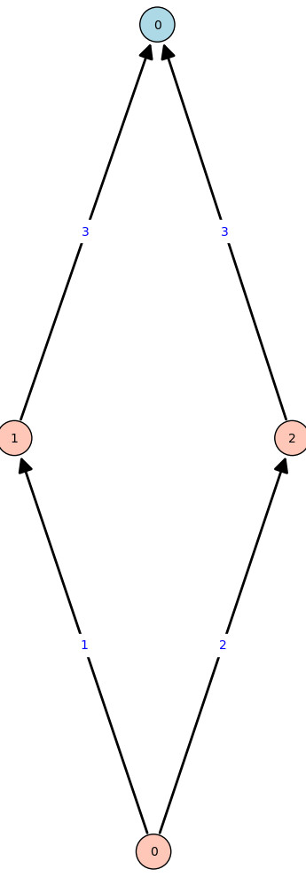

# Overview
This repository contains the source code of the automatic search described in
our paper Simon's Algorithm and Symmetric Crypto: Generalizations and
Automatized Applications. We can divide the code basically in four parts. First
there is the code for the actual search, as described in Section 5 of our paper.
Second, there are files that contain the setups of our search that we used to
find some previously known attacks. We cover these only partly in the paper. The
main purpose of this is to show that our approach does indeed work. We also
set up a foundation of input nodes and rules that we can reuse when we search for
new attacks. Next, there are setups of the searches that lead to the new attacks,
most importantly the ones on MISTY and Feistel which we describe in Section
3.2. Last, there are setups of searches that were unsuccessful. Below we list
the constructions we examined.

| file                                                     | attack       |
|----------------------------------------------------------|--------------|
| [even_mansour.sage](even_mansour.sage)                   | known        |
| [feistel_known.sage](feistel_known.sage)                 | known        |
| [feistel_novel.sage](feistel_novel.sage)                 | new          |
| [fx.sage](fx.sage)                                       | known        |
| [hctr.sage](hctr.sage)                                   | known        |
| [iterated_even_mansour.sage](iterated_even_mansour.sage) | known        |
| [LRWQ.sage](LRWQ.sage)                                   | unsuccessful |
| [macs.sage](macs.sage)                                   | known        |
| [misty.sage](misty.sage)                                 | new          |
| [pEDM.sage](pEDM.sage)                                   | new  (GMS)   |
| [sokac.sage](sokac.sage)                                 | new  (GMS)   |
| [sponge.sage](sponge.sage)                               | unsuccessful |
| [sum_of_even_mansour.sage](sum_of_even_mansour.sage)     | known        |

# Usage
[even_mansour.sage](even_mansour.sage) is a good way to start since the attack
on Even-Mansour is simple. The setup for each search is encapsulated in a
function, so to execute the search, you only need to load and run it.

```sage
sage: load("even_mansour.sage")
sage: even_mansour_search()
Keys:  [7, 12]
Circuit with periods (7,): 545
Searched through circuit tree of size 1012
-> 40 inner nodes ((3.95%))
-> 972 leaves ((96.05%))
Number of circuits tested with rules:  213  ((21.05%))
-> inner nodes: 25 ((62.5%) of inner nodes,  (11.74%) of tests)
-> leaves: 188 ((19.34%)% of leaves,  (88.26%)% of tests)
Number of circuits tested for periodicity:  17 ((1.75%)% of leaves)
-> 16 without, 0 with trivial and  1 with interesting period
```

If you want to have a closer look, a more interactive usage is sensible. If you
execute the code inside the `even_mansour_search` function, you can load and
plot the found circuit.

```sage
sage: CI.C.from_int(545); CI.C.show()
Launched png viewer for Graphics object consisting of 13 graphics primitives
```



The blue node represents the input. Orange nodes represents gates where the
number is the index of the gate in the list of the circuit. In this case, `0`
is XOR, `1` is encryption and `2` is the public permutation (see setup of
Even-Mansour search below). The edges are labeled with `1` for the left
predecessor, `2` for the right predecessor and `3` if both are the same. Notice
that the notation in the paper differs slightly and reverses all edges. The
above circuit corresponds to the function `f(x) = E(x) XOR P(x)`.

Sometimes the generated graphs are laid out poorly but you can print the
internals of the circuit, i.e., the associated gate function and the left and
right predecessor of each node.

```sage
sage: CI.C.gates; CI.C.lefts; CI.C.rights
[None, 1, 2, 0]
[None, 0, 0, 1]
[None, 0, 0, 2]
```

# Set up a Search
Let's have a closer look at the setup of the search on Even-Mansour.

```sage
load("attack.sage")
load("helper_functions.sage")
load("rules.sage")

def even_mansour_search():
    # sample keys and random permutation
    N = 4
    key = random.sample(range(1, 2^N), 2)
    print("Keys: ", key)
    P = random_permutation(2^N)

    # prepare gates
    P_ = lambda x,y: P(x)
    E = lambda x, y: P(x ^^ key[0]) ^^ key[1]
    XOR = lambda x,y: x^^y
    GATES = [XOR, E, P_]

    # prepare input nodes
    X = [x for x in range(2^N)]
    C_init = [X]

    RULES = [rule_is_normal,
             gen_rule_single_input([1,2]),
             gen_rule_number_of_oracles([([1], 1)]),
             rule_xors]

    # search for periodic circuit
    CI = CircuitIterator(C_init, GATES, 3, RULES)
    CI.search_periodic_circuit()
```

We first load the backend of the attack. Then, encapsulated in a function, we
first sample the building blocks of Even-Mansour, i.e., two random keys and a
random permutation. Next we define the gates, i.e., the building blocks of our
circuit. A gate is simply a function that takes two inputs and has one
output. For `P` and `E` we only have one input, so we simply ignore the
second. Notice that our implementation requires that the first gate is always XOR.
Next, we define the initial circuit, i.e., the input nodes of the
circuits. Here, we only have one input. For other searches, we might add
additional input such as constants. Last, we define some rules. The purpose of
rules are to exclude as many useless circuits as
possible. [rules.sage](rules.sage) contains a number of predefined rules you can
use. With gates, initial circuit and rules being defined, we can start the
search. Here, we have to specify the size of circuit, i.e., the number of gates
that will be added (3 in this case).

# Grover-Meets-Simon
Our implementation can not only be utilized to search for attacks based on
Simon's algorithm, but also to search for attacks based on
Grover-Meets-Simon. The idea is simply to add an additional input node `u` and
search for circuits for which for a specific `u*` we obtain a periodic function.
Let's again have a look at a simple example, namely the FX construction.

```sage
load("attack.sage")
load("helper_functions.sage")
load("rules.sage")


def fx_gms_search():
    N = 5
    ED = [random_permutation(2^N, inverseToo=True) for _ in range(2^N)]
    E, D = [ED[i][0] for i in range(2^N)], [ED[i][1] for i in range(2^N)]
    RND = random_permutation(2^N)

    key = [ZZ.random_element(2^N), ZZ.random_element(2^N), ZZ.random_element(2^N)]
    assert key[1] != 0, "key is zero"
    assert key[2] != 0, "key is zero"

    FX = lambda x,y: E[key[0]](x ^^ key[1]) ^^ key[2]
    ENC = lambda x, y: E[y](x)
    DEC = lambda x, y: D[y](x)
    XOR = lambda x,y: x^^y
    FX_rnd = lambda x,y: RND(x)

    U = [u for u in range(2^N) for _ in range(2^N)]
    X = [x for _ in range(2^N) for x in range(2^N)]

    C_init = [U, X]

    GATES = [XOR, FX, ENC]
    GATES_random = [XOR, FX_rnd, ENC]

    RULES = [rule_is_normal, rule_xors,
             gen_rule_single_input([1]),
             gen_rule_number_of_oracles(MIN=[([1], 1)])]

    print(key)
    CI = CircuitIterator(C_init, GATES, 3, RULES, GATES_random)
    #CI.search_periodic_circuit_gms(N, N, u_=key[0], compare_random=True)
    CI.search_periodic_circuit_gms(N, N, compare_random=True)
```

The setup is similar to the one for Even-Mansour, but there are two
differences. On the one hand, we add the additional input node `u` and use the
corresponding `_gms` version of our search algorithm. If we have an idea what
the value of `u*` should be, we can specify it and only test for that value to
speed up the computation. On the other hand, we specify random versions of our
gates. Thereby, our algorithm can check whether the random version of a function
still is periodic. If so, the period is trivial and the function is ignored.


